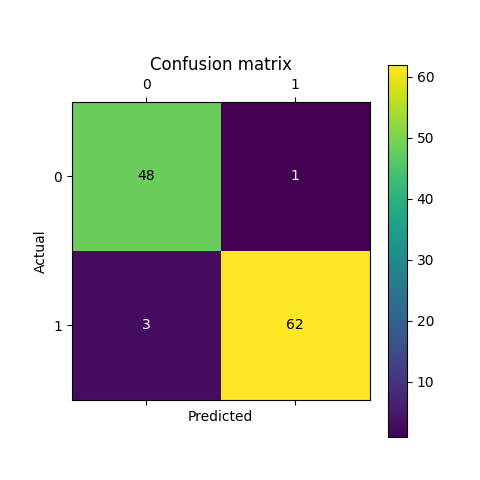

<h1>ML with KNN Classifier to Predict Breast Cancer</h1>
<h2>Dataset Info & Source</h2>

The dataset used for this ML with KNN Classifier to Predict Breast Cancer was obtained through importing load_breast_cancer from sklearn.datasets, which obtained the data from the following link. <a href="https://archive.ics.uci.edu/dataset/17/breast+cancer+wisconsin+diagnostic">https://archive.ics.uci.edu/dataset/17/breast+cancer+wisconsin+diagnostic</a>

<h2>Methods</h2>
    
For training and validation, the dataset was split into training data and labels and validation data and labels, with a test size of 0.2.

    
Using scikit-learn's KNeightborsClassifier, to determine the most accurate number of nearest neighbors for the KNN Classification model, I determined the accuracy of each model with k-values ranging from 1 to 100, inclusive with a loop. The most accurate k-value for the dataset was determined to be 23.

    
After determining this, I created the model with this k-value, fit it to the training set, and tested on the validation data.

<h2>Results</h2>
    
This model is highly accurate for predicting breast cancer on the validation data.

    <ul>
        <li>Accuracy: 0.9649122807017544</li>
        <li>Precision: 0.9538461538461539</li>
        <li>Recall: 0.9841269841269841</li>
        <li>F1 Score: 0.96875</li>
    </ul>
    </img>
<h2>Libraries Used</h2>
<ul>
    <li>scikit-learn</li>
    <li>matplotlib</li>
    <li>pandas</li>
</ul>